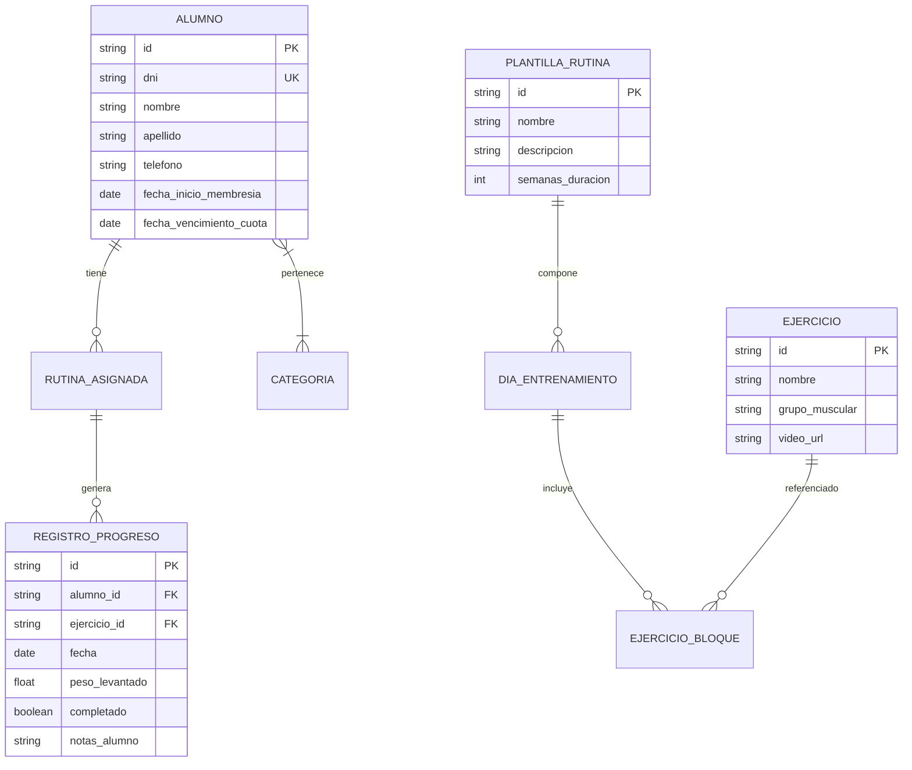

# Documento de Requisitos de Producto (PRD)

**Proyecto:** Plataforma Web de Gestión de Entrenamientos y Rutinas  
**Tipo de Aplicación:** Web App SaaS Multi-tenant (B2B2C / Slug-in-Path)  
**Fecha:** Septiembre 2026  
**Estado:** Evolución Multi-tenant Aprobada

---

## 1. Visión y Objetivos del Producto

- **Problema a resolver:** Los entrenadores personales independientes y gimnasios boutique gestionan alumnos, rutinas, planes y cobranzas mediante hojas de cálculo o apps genéricas que imponen alta fricción al alumno y costos prohibitivos de infraestructura por cada cliente nuevo.
- **Solución:** Una plataforma web SaaS multi-tenant con un único build y deployment, donde cada entrenador dispone de su propio portal de marca blanca accesible mediante un slug amigable (`tuapp.com/[coachSlug]`). Los alumnos consultan su rutina y registran avances en segundos usando únicamente su DNI sin registros complejos, mientras que el entrenador administra alumnos, planes, pagos y rutinas en un panel privado. La plataforma cuenta además con un rol **SuperAdmin** para la gestión global de entrenadores y métricas comerciales.

---

## 2. Actores del Sistema

1. **SuperAdmin (Owner de la Plataforma):** Administrador global del sistema. Gestiona el ciclo de vida de los entrenadores (altas, bajas, suspensión por mora del SaaS), asignación de slugs y visualiza métricas consolidadas de la plataforma.
2. **Entrenador / Coach (Tenant Admin):** Cliente directo del SaaS (B2B). Accede a su panel privado para gestionar sus alumnos, planes, cuotas, biblioteca de ejercicios, plantillas de rutinas y personalizar su propia identidad de marca blanca (logo, portada, redes, contacto).
3. **Alumno (Cliente Final):** Usuario final del entrenador (B2C). Accede al portal específico de su entrenador ingresando al slug correspondiente (`tuapp.com/[coachSlug]`) e identificándose exclusivamente con su DNI para ver rutinas activas y registrar progreso.

---

## 3. Requisitos Funcionales (RF)

### Módulo 0: Administración de la Plataforma (Panel SuperAdmin)

- **RF-0.1 Gestión de Entrenadores (Tenants):** Alta, edición, activación y suspensión de cuentas de entrenadores con email, contraseña, nombre y slug único.
- **RF-0.2 Validación y Control de Slugs:** Asignación de slugs amigables con validación estricta de formato y bloqueo de palabras reservadas del sistema (ej. `admin`, `superadmin`, `login`, `api`, `assets`).
- **RF-0.3 Métricas Globales:** Visualización consolidada de entrenadores activos, total de alumnos en la plataforma y estado de las cuentas.

---

### Módulo 1: Acceso y Experiencia del Alumno (Portal Mobile-First por Slug)

- **RF-1.1 Acceso Contextual por Slug y DNI:** Acceso directo a `tuapp.com/[coachSlug]` con validación del estado activo del entrenador. El alumno ingresa su DNI y el sistema busca su ficha dentro del ámbito exclusivo de ese entrenador.
- **RF-1.2 Identidad de Marca Blanca Dinámica:** El portal del alumno renderiza dinámicamente el nombre comercial, titular, logo, imagen de portada, WhatsApp y redes sociales configuradas por su entrenador específico.
- **RF-1.3 Control de Acceso por Cuotas:** Evaluación automática de la vigencia de la cuota o bloqueo manual del entrenador, redirigiendo a pantallas informativas con contacto directo al entrenador.
- **RF-1.4 Visualización de Rutina:** Presentación estructurada de la rutina activa dividida por días/bloques de entrenamiento con videos embebidos, series, repeticiones, RPE/intensidad, descansos y notas técnicas.
- **RF-1.5 Registro de Progreso:** Marcado de completitud por ejercicio, registro de peso levantado, notas de feedback y peso corporal diario.

---

### Módulo 2: Gestión de Alumnos y Perfiles (Panel Entrenador)

- **RF-2.1 CRUD de Alumnos Aislado por Tenant:** Crear, listar, editar y deshabilitar alumnos vinculados estrictamente al entrenador autenticado.
- **RF-2.2 Unicidad de DNI por Entrenador:** Permitir que dos entrenadores diferentes puedan registrar alumnos con el mismo número de DNI sin colisión.
- **RF-2.3 Categorización y Filtros:** Clasificar alumnos por objetivos, niveles, modalidades y filtrar el listado por tipo de plan de suscripción.
- **RF-2.4 Ficha de Alumno y Control de Acceso:** Modificación del estado de acceso (`auto`, `allowed`, `blocked`) y gestión del historial de pagos y suscripciones.

---

### Módulo 3: Planes, Cuotas y Cobranzas (Panel Entrenador)

- **RF-3.1 Gestión de Planes de Suscripción:** Creación y edición de planes con nombre, precio, duración en días y estado activo/inactivo, aislados por entrenador.
- **RF-3.2 Libro Diario de Pagos (Ledger):** Registro de pagos y asignación de suscripciones con impacto automático en la fecha de vencimiento.
- **RF-3.3 Dashboard Financiero:** Métricas de ingresos mensuales estimados, dinero pendiente de cobro, distribución de alumnos por plan y alertas de vencimientos próximos o adeudados.

---

### Módulo 4: Creación y Asignación de Rutinas

- **RF-4.1 Biblioteca de Ejercicios:** Catálogo base del sistema con soporte para ejercicios personalizados por entrenador.
- **RF-4.2 Plantillas de Entrenamiento:** Creación, edición, agrupación en superseries (bloques) y duplicación de plantillas reutilizables propias de cada entrenador.
- **RF-4.3 Asignación Individual y Masiva:** Asignación de plantillas con personalización de cargas/series por alumno sin alterar la plantilla base.
- **RF-4.4 Importación Masiva (CSV):** Carga masiva de alumnos y plantillas validada contra el tenant del entrenador autenticado.

---

### Módulo 5: Configuración de Marca Blanca (Panel Entrenador)

- **RF-5.1 Perfil y Personalización:** Configuración del nombre de fantasía, titular, bajada, enlace a logo, imagen de portada, número de WhatsApp de contacto y cuenta de Instagram.

---

## 4. Reglas de Negocio (RN)

- **RN-01 (Ciclo de Vida de Rutinas):** Toda rutina asignada mantiene su vigencia hasta ser reemplazada o archivada manualmente por el entrenador.
- **RN-02 (Aislamiento de Plantillas):** La modificación individual de una rutina no altera la plantilla base ni impacta en otros alumnos.
- **RN-03 (Unicidad de Identificador por Tenant):** El DNI del alumno es único **por entrenador** (`trainerId + dni`). No existen colisiones entre alumnos de distintos profesores.
- **RN-04 (Estado de Rutinas):** Un alumno solo puede tener una única rutina en estado **Activa** simultáneamente por entrenador.
- **RN-05 (Aislamiento Estricto de Datos):** Ningún entrenador puede consultar, modificar ni inferir la existencia de alumnos, rutinas, planes o pagos de otro entrenador.
- **RN-06 (Restricción de Slugs del Sistema):** No se permite la creación ni modificación de slugs que coincidan con rutas fijas de la plataforma (`admin`, `superadmin`, `login`, `api`, `dashboard`, `alumnos`, `planes`, `assets`, `rutina`, `favicon.ico`).

---

## 5. Requisitos No Funcionales (RNF)

- **RNF-01 (Diseño Mobile-First):** La interfaz del alumno debe estar estrictamente optimizada para dispositivos móviles en entorno de gimnasio (elementos táctiles amplios, legibilidad clara y soporte de alto contraste).
- **RNF-02 (Rendimiento y Latencia):** El tiempo de respuesta y renderizado tras ingresar el DNI debe ser inferior a 1.5 segundos en conexiones móviles 4G estándar.
- **RNF-03 (Capacidad de Procesamiento Masivo):** Capacidad de procesar lotes de asignación e importación masiva de hasta 500 alumnos en simultáneo sin degradación del servicio.
- **RNF-04 (Seguridad y Privacidad):** Autenticación y cifrado de sesión para el panel administrativo del entrenador; validación y sanitización estricta de parámetros en el acceso por DNI.

---

## 6. Modelo Conceptual de Datos

