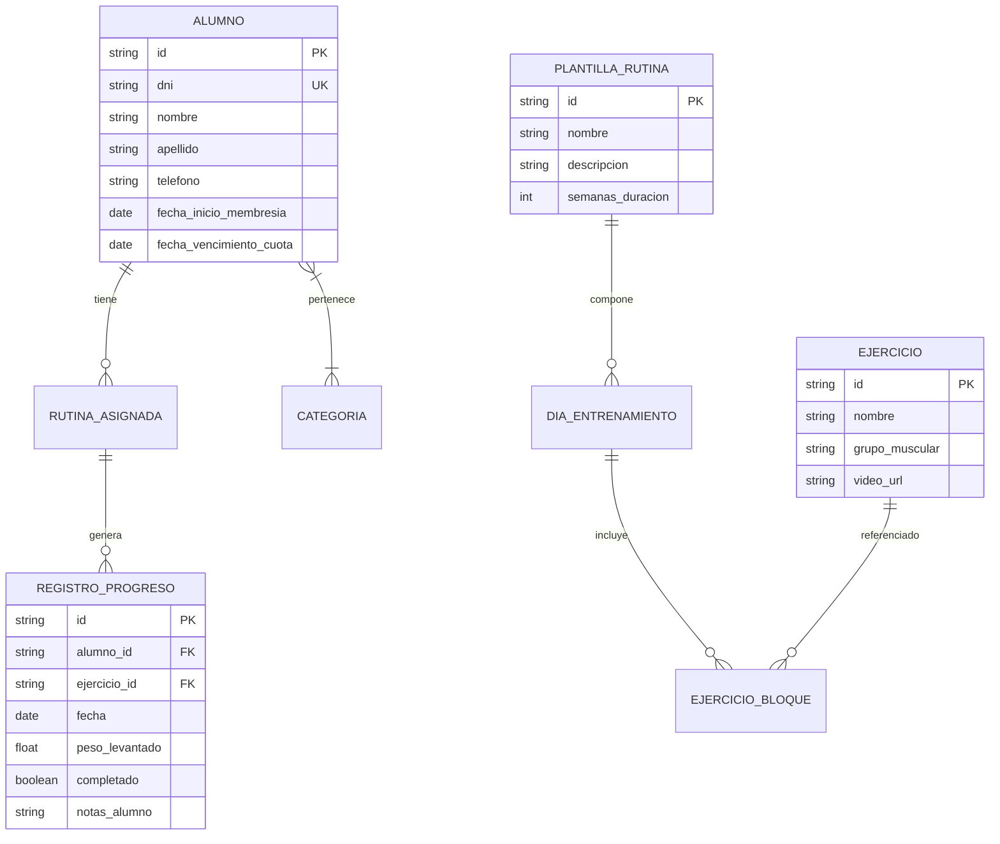

# Documento de Requisitos de Producto (PRD)

**Proyecto:** Plataforma Web de Gestión de Entrenamientos y Rutinas (MVP)  
**Tipo de Aplicación:** Web App (Single-Trainer / Unipersonal)  
**Fecha:** Agosto 2026  
**Estado:** Definición de Requerimientos

---

## 1. Visión y Objetivos del Producto

- **Problema a resolver:** La creación, asignación y seguimiento manual de rutinas para decenas o cientos de alumnos genera una alta carga operativa para el entrenador. A su vez, las aplicaciones tradicionales introducen fricción innecesaria en el alumno (descargas pesadas, registros con contraseñas que se olvidan).
- **Solución:** Una aplicación web ligera y accesible donde el alumno consulta su rutina diaria en segundos utilizando únicamente su número de DNI, registrando progreso (pesos levantados, notas de feedback, check de completado), y donde el entrenador administra planes de forma individual, masiva (por categorías/plantillas) y mediante importación de archivos.

---

## 2. Actores del Sistema

1. **Entrenador (Admin):** Único usuario con privilegios de administración y autenticación formal. Gestiona la lista de alumnos, el catálogo de ejercicios, las plantillas de entrenamiento y las asignaciones directas o masivas.
2. **Alumno (Cliente):** Usuario final que accede sin registro de credenciales complejas (identificación directa vía DNI) para consultar su rutina activa y registrar su avance diario.

---

## 3. Requisitos Funcionales (RF)

### Módulo 1: Acceso y Experiencia del Alumno (Portal Mobile-First)

- **RF-1.1 Identificación por DNI:** Acceso directo al portal web introduciendo únicamente el número de documento para visualizar la rutina activa asignada.
- **RF-1.2 Visualización de Rutina:**
  - Presentación estructurada de la rutina activa dividida por días/bloques de entrenamiento.
  - Detalle por ejercicio: Nombre, series, repeticiones/tiempo, tiempo de descanso sugerido, notas técnicas del entrenador y enlace a video demostrativo (ej. YouTube/Vimeo).
- **RF-1.3 Registro de Progreso:**
  - Marcado de cada ejercicio o serie completada mediante casilla de verificación (checkbox).
  - Registro de la carga utilizada (peso levantado en kg o lbs por serie o por ejercicio).
  - Campo de texto libre para notas y feedback adicional por sesión (ej. molestias articulares, sensaciones generales, sustituciones).
- **RF-1.4 Persistencia de Sesión:** Almacenamiento seguro del progreso y notas asociadas a la fecha y sesión de entrenamiento correspondiente.

---

### Módulo 2: Gestión de Alumnos y Perfiles (Panel Entrenador)

- **RF-2.1 CRUD de Alumnos:** Crear, listar, editar y deshabilitar alumnos con datos mínimos obligatorios (Nombre, Apellido, DNI, Email y/o Teléfono).
- **RF-2.2 Categorización:** Clasificar a los alumnos mediante etiquetas y atributos clave (ej. _Objetivo: Hipertrofia / Fuerza / Descenso_, _Nivel: Principiante / Intermedio / Avanzado_, _Modalidad: Gimnasio / Casa_).
- **RF-2.3 Ficha Opcional de Seguimiento:** Campos configurables para registrar de forma no obligatoria fecha de inicio de membresía, fecha de vencimiento de cuota y observaciones de salud o lesiones preexistentes.

---

### Módulo 3: Creación y Asignación de Rutinas

- **RF-3.1 Biblioteca de Ejercicios:** Catálogo centralizado y administrable de ejercicios con nombre, grupo muscular principal/secundario y URL de video demostrativo.
- **RF-3.2 Plantillas de Entrenamiento:**
  - Creación de estructuras de rutinas reutilizables (ej. _Torso / Pierna 4 días - Nivel Medio_).
  - Duplicación y edición de plantillas existentes para acelerar la creación de nuevas variantes.
- **RF-3.3 Asignación Individual:** Asignación de una plantilla a un alumno puntual con capacidad de personalizar ejercicios, repeticiones o cargas sin modificar la plantilla base.
- **RF-3.4 Asignación Masiva por Categoría:** Selección de grupos de alumnos filtrados por categoría/etiqueta y vinculación simultánea a una plantilla de rutina en una única operación.
- **RF-3.5 Importación de Rutinas vía Archivo (Excel/CSV):**
  - Mecanismo de carga de archivos estructurados para poblar o actualizar ejercicios, bloques de rutinas y asignaciones.
  - Validación previa a la importación con reporte detallado de inconsistencias, errores de formato o DNI no registrados.

---

## 4. Reglas de Negocio (RN)

- **RN-01 (Ciclo de Vida de Rutinas):** Toda rutina asignada debe tener una vigencia mínima de 2 semanas. El sistema no requerirá renovación antes de este periodo salvo modificación manual explícita por parte del entrenador.
- **RN-02 (Aislamiento de Plantillas):** La modificación individual de una rutina asignada a un alumno no altera la plantilla base ni impacta en otros alumnos que compartan la misma plantilla.
- **RN-03 (Unicidad de Identificador):** El DNI del alumno constituye el identificador único dentro del sistema para las consultas públicas en el portal.
- **RN-04 (Estado de Rutinas):** Un alumno solo puede tener una única rutina en estado **Activa** simultáneamente. Las rutinas anteriores pasan automáticamente al estado **Histórico**.

---

## 5. Requisitos No Funcionales (RNF)

- **RNF-01 (Diseño Mobile-First):** La interfaz del alumno debe estar estrictamente optimizada para dispositivos móviles en entorno de gimnasio (elementos táctiles amplios, legibilidad clara y soporte de alto contraste).
- **RNF-02 (Rendimiento y Latencia):** El tiempo de respuesta y renderizado tras ingresar el DNI debe ser inferior a 1.5 segundos en conexiones móviles 4G estándar.
- **RNF-03 (Capacidad de Procesamiento Masivo):** Capacidad de procesar lotes de asignación e importación masiva de hasta 500 alumnos en simultáneo sin degradación del servicio.
- **RNF-04 (Seguridad y Privacidad):** Autenticación y cifrado de sesión para el panel administrativo del entrenador; validación y sanitización estricta de parámetros en el acceso por DNI.

---

## 6. Modelo Conceptual de Datos

